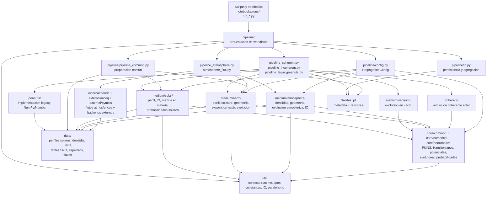
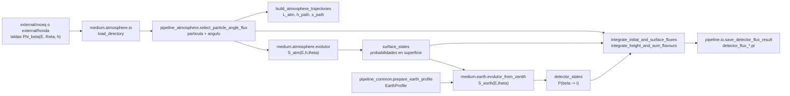

# Diagrama de modulos y flujo de pipelines

Este documento resume la estructura funcional de `tpeanuts` a partir del codigo
actual del proyecto. El objetivo es separar los niveles de responsabilidad:
configuracion y orquestacion, modelos fisicos por medio, nucleo numerico, datos
externos y salidas.

## Vista general de modulos

## Pipeline solar: produccion a detector

El pipeline solar tiene tres rutas de ejecucion: coherente torch-native,
incoherente torch-native y legacy `peanuts`. Las tres comparten configuracion,
preparacion de perfiles y formato de salida.

```mermaid
flowchart LR
    Inputs["Entradas<br/>E_MeV, fuente solar, parametros PMNS,<br/>perfil solar, densidad Tierra,<br/>distancia Sol-Tierra, exposicion nadir"]
    Config["PropagationConfig<br/>runtime, oscillation, exposure,<br/>earth, solar, production_mode"]
    Common["pipeline_common<br/>prepare_earth_profile<br/>prepare_earth_distance<br/>prepare_initial_state"]

    subgraph CoherentPath["Ruta coherente: pipeline_coherent.py"]
        ProdGrid["Grid de produccion rho<br/>point/coherent/incoherent"]
        SolarState["coherent.evolution.solar_surface_state<br/>estado en superficie solar"]
        Vacuum["medium.vacuum.evolutor<br/>propagacion superficie solar -> Tierra"]
        EarthOp["medium.earth.evolutor<br/>operador Tierra por eta"]
        CoherentProb["core.common.probability<br/>|psi|^2 en detector"]
        CoherentAvg["Promedio/integracion<br/>rho y exposicion nadir"]
    end

    subgraph IncoherentPath["Ruta incoherente: pipeline_incoherent.py"]
        SolarMass["medium.solar.probability.solar_probability_mass<br/>pesos de autoestados de masa"]
        Psolar["medium.solar.probability.psolar<br/>probabilidades solares"]
        Pearth["medium.earth.probability.pearth<br/>massbasis=True"]
        IncohAvg["Integracion sobre exposicion nadir"]
    end

    subgraph LegacyPath["Ruta legacy: pipeline_legacypeanuts.py"]
        LegacySolar["peanuts.solar.solar_flux_mass / Psolar"]
        LegacyEarth["peanuts.earth.Pearth<br/>massbasis=True"]
        LegacyAvg["Integracion legacy de exposicion"]
    end

    Output["Resultado .pt<br/>metadata, grids, probabilidades,<br/>estados u operadores segun modo"]

    Inputs --> Config --> Common
    Common --> ProdGrid --> SolarState --> Vacuum --> EarthOp --> CoherentProb --> CoherentAvg --> Output
    Common --> SolarMass --> Psolar --> Pearth --> IncohAvg --> Output
    Common --> LegacySolar --> LegacyEarth --> LegacyAvg --> Output
```

## Pipeline atmosferico: flujo de produccion a detector

El flujo atmosferico parte de tablas externas o generadas por MCEq/Honda,
selecciona una particula y angulo, propaga estados coherentes por atmosfera y
Tierra, y finalmente integra sobre la altura de produccion.

## Flujo alternativo atmosferico por matriz de probabilidad

`pipeline/atmosphere_flux.py` ofrece una ruta mas compacta para propagar
directamente un vector o una malla de flujos usando
`P = |S_earth S_atm|^2`.

## Responsabilidades clave

- `pipeline/`: define workflows de alto nivel, decide que perfiles construir,
  que grids usar, como combinar etapas y como guardar resultados.
- `pipeline/config.py`: concentra parametros de runtime, oscilacion, medio
  solar, Tierra, atmosfera, exposicion y modo de produccion.
- `pipeline/pipeline_common.py`: prepara objetos compartidos como
  `EarthProfile`, distancia Sol-Tierra y estado inicial.
- `medium/*`: contiene la fisica especifica de cada medio: solar, vacio,
  Tierra y atmosfera.
- `core/*`: contiene los bloques de bajo nivel comunes: PMNS, Hamiltonianos,
  potenciales, operadores de evolucion y conversion a probabilidades.
- `external/*`: genera o adapta integraciones externas, especialmente
  MCEq/Honda para flujos atmosfericos y PyMSIS para densidad atmosferica.
- `peanuts/`: implementacion legacy usada para compatibilidad y validacion.
- `data/`: datos de entrada versionados o de referencia.
- `notebooks/runs/*` y `run_*.py`: scripts consumidores que parametrizan y
  lanzan los pipelines.

## Salidas principales

- Solar:
  - `run_and_save_solar_to_detector_coherent`
  - `run_and_save_solar_to_detector_incoherent`
  - `run_and_save_solar_to_detector_legacypeanuts`
  - salida: `.pt` con `metadata`, grids, probabilidades y, segun modo,
    estados coherentes u operadores.
- Atmosfera:
  - `save_detector_flux_result`
  - salida: `.pt` por particula y angulo, con `detector_flux_Ei`,
    `surface_flux_Ei`, `initial_flux_Ei`, probabilidades y metadata.
